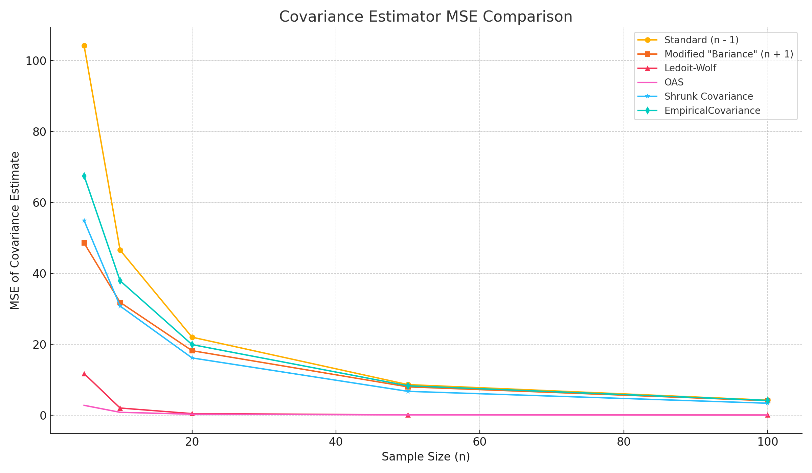

# ShrunkenCovarEstims
This Repository consolidates empirically using Monte Carlo simulations for all existing popular covariance estims for different n.

## Formulas

### 0. Standard Formula and "Bariance" modified n+1 denominator formula

### 1. Empirical Covariance (MLE)

Maximum likelihood estimator under multivariate normality:

    Σ_MLE = (1 / n) * Σᵢ (xᵢ - x̄)(xᵢ - x̄)ᵗ

---

### 2. Shrunk Covariance Estimator

Linear shrinkage toward a target matrix T:

    Σ_shrunk = (1 - α) * S + α * T

Where:
- S: empirical covariance
- T: shrinkage target (often μ * I), where μ = Tr(S) / p
- α ∈ [0, 1]: shrinkage intensity

---

### 3. Ledoit-Wolf Shrinkage Estimator

Same form as above, but α is computed optimally to minimize expected MSE:

    Σ_LW = (1 - α*) * S + α* * T

α* is selected to minimize:

    E[‖Σ_LW - Σ‖_F²]

---

### 4. Oracle Approximating Shrinkage (OAS)

Improved shrinkage for Gaussian-distributed data:

    Σ_OAS = (1 - α_oas) * S + α_oas * T

With:

    α_oas = [(1 - 2/p) * Tr(S²) + Tr(S)²] 
            --------------------------------------------
            [(n + 1 - 2/p) * (Tr(S²) - Tr(S)² / p)]

Where:
- Tr(S): trace of S
- S²: element-wise square of S
- p: number of features
- n: number of samples

## Estimators Compared

- Standard (n - 1)
- Modified \"Bariance\" (n + 1)
- Ledoit-Wolf
- Oracle Approximating Shrinkage (OAS)
- Shrunk Covariance
- Empirical Covariance (MLE)

## Output

